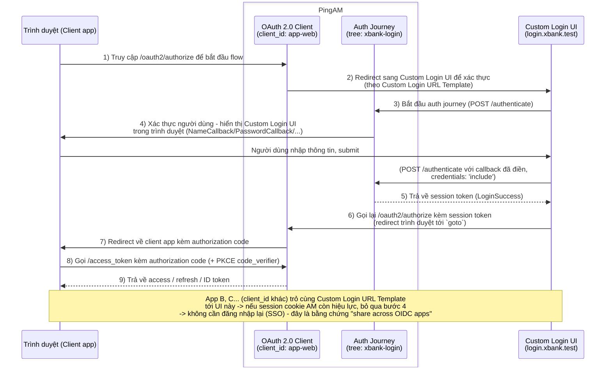

# Custom Login UI dùng chung cho nhiều OIDC app — PingAM 8.1.1

Một trang đăng nhập (SPA React + TypeScript + Tailwind) mà **nhiều OAuth2/OIDC client** trên
PingAM cùng redirect người dùng tới, thay vì mỗi app tự cài UI đăng nhập riêng (hoặc dùng XUI mặc
định của AM). Triển khai theo use-case chính thức của Ping,
["Creating a custom UI app to share across OIDC apps"](https://developer.pingidentity.com/orchsdks/oidc/use-cases/custom-login-ui/index.html),
bằng **[Ping Orchestration SDK](https://developer.pingidentity.com/orchsdks/index.html)** cho
JavaScript (`@forgerock/journey-client`, `@forgerock/oidc-client` — xem lưu ý về SDK cũ ở Phần 4).

## Luồng hoạt động (Authorization Code + shared login UI)

Theo sơ đồ kiến trúc chính thức của Ping (tách 2 thành phần của AM: **OAuth 2.0 Client** xử lý
`/authorize`/`/access_token`, **Auth Journey** xử lý `/authenticate`), minh hoạ bằng entity thật
của repo:



## Cấu trúc repo

```text
custom-UI-app-oidc/
  src/                # Custom UI App (trang đăng nhập dùng chung) - xem Phần 2
  web-app/
    app/              # OIDC RP client #1 (test) - xem Phần 3
    insurance/        # OIDC RP client #2 (test) - xem Phần 3
  certs/              # cert HTTPS local (mkcert) - không commit
```

---

## Phần 1 — Hướng dẫn cấu hình PingAM

Toàn bộ bước dưới đây làm trên **AM Console**. Ví dụ dùng domain `xbank.test`:
UI login tại `login.xbank.test:9443`, AM tại `idp.xbank.test`, 2 OIDC client test tại
`app.xbank.test:5174` và `insurance.xbank.test:5175`.

### 1.1. Bật OAuth2 Provider service (theo từng realm)

Mỗi realm muốn đăng ký OAuth2 client đều cần có service này trước:

AM Console → chọn realm → **Services** → **Add a Service** → chọn **OAuth2 Provider** → tạo với
cấu hình mặc định (chỉnh sau nếu cần).

Verify: gọi `GET <AM_BASE_URL>/oauth2/realms/root/realms/<realm>/.well-known/openid-configuration`
(realm con) hoặc `GET <AM_BASE_URL>/oauth2/realms/root/.well-known/openid-configuration` (realm
gốc) phải trả `200` kèm JSON (`issuer`, `authorization_endpoint`, `token_endpoint`, ...). Nếu
chưa tạo service, AM trả `{"error":"not_found","error_description":"No OAuth2 provider for realm ..."}`.

### 1.2. Bật CORS Service

AM Console → **Configure → Global Services → CORS Service → Configuration**:

- Bật CORS filter (toggle "Enabled" tổng ở đầu trang, tách biệt với các secondary configuration
  bên dưới — dễ bị bỏ sót).
- Thêm secondary configuration (ví dụ tên `custom-login-ui`), khai:
  - **Accepted Origins**: liệt kê **đầy đủ, chính xác** origin của UI login và của từng OIDC RP
    client sẽ gọi thẳng AM bằng `fetch()`, ví dụ:
    `https://login.xbank.test:9443`, `https://app.xbank.test:5174`,
    `https://insurance.xbank.test:5175`. Phải khớp tuyệt đối scheme + host + port, không dấu `/`
    cuối — sai 1 ký tự là CORS fail.
  - **Accepted Methods**: `GET`, `POST`, **`OPTIONS`** — thiếu `OPTIONS` khiến preflight bị AM trả
    `405` thay vì được CORS filter xử lý đúng.
  - **Accepted Headers**: `accept-api-version`, `x-requested-with`, `content-type`,
    `authorization`, `if-match`, `iPlanetDirectoryPro`, `ch15fefc5407912`.
  - **Allow Credentials**: `true` — bắt buộc, vì UI login gọi `/authenticate` với
    `credentials: 'include'` để nhận session cookie.

Verify nhanh bằng `curl` (không cần trình duyệt):

```bash
curl -is -X OPTIONS '<AM_BASE_URL>/json/realms/root/realms/<realm>/authenticate?authIndexType=service&authIndexValue=<tree>' \
  -H 'Origin: <UI_ORIGIN>' \
  -H 'Access-Control-Request-Method: POST' \
  -H 'Access-Control-Request-Headers: content-type,accept-api-version,x-requested-with'
```

Kỳ vọng `200` kèm header `Access-Control-Allow-Origin` đúng origin. Nếu trả `405` kèm cảnh báo
`"No Accept-API-Version specified"`/`"chf"`, nghĩa là request đã lọt qua CORS filter xuống thẳng
REST endpoint thật (không hỗ trợ `OPTIONS`) — quay lại kiểm tra Origin/Method ở trên.

### 1.3. Tạo OAuth2/OIDC Client cho từng app dùng chung UI login

AM Console → realm đã bật OAuth2 Provider ở 1.1 → **Applications → OAuth 2.0 → Clients → Add
Client**. Tạo **một client riêng cho mỗi app**:

| Field | Giá trị |
| --- | --- |
| Client ID | định danh riêng cho từng app, ví dụ `app-web`, `insurance-web` |
| Client type (tab Core) | **Public** (SPA dùng PKCE, không có client secret) |
| Redirection URIs | origin thật của app + đúng path callback, ví dụ `https://app.xbank.test:5174/callback` — phải khớp **chính xác từng ký tự** với `redirect_uri` app gửi, sai là AM trả `redirect_uri_mismatch` |
| Scopes | `openid`, `profile`, `email` |
| Token Endpoint Authentication Method (tab Advanced) | `none` |

### 1.4. Custom Login URL Template — cơ chế "share across OIDC apps"

Đây là bước cốt lõi biến nhiều OAuth2 client thành "dùng chung 1 UI login". Với **mỗi** client đã
tạo ở 1.3, vào tab **OAuth2 Provider Overrides**:

- **Enable OAuth2 Provider Overrides** = **Enabled**
- **Custom Login URL Template** = URL của UI login kèm biến FreeMarker AM sẽ tự điền:

  ```text
  https://login.xbank.test:9443?goto=${goto}<#if acrValues??>&acr_values=${acrValues}</#if><#if realm??>&realm=${realm}</#if><#if module??>&module=${module}</#if><#if service??>&service=${service}</#if><#if locale??>&locale=${locale}</#if>
  ```

- **Use Client-Side Access & Refresh Tokens**: bật nếu client là SPA lấy token phía client.

Mọi client trỏ **cùng một giá trị** Custom Login URL Template ở trên → cùng dùng một UI login vật
lý. Đây chính là "share across OIDC apps".

> Tên field/tab lấy từ tài liệu chính thức Ping (xem Phần 4). Nếu console bạn dùng khác chút, tìm
> theo tên thuộc tính `customLoginUrlTemplate` của entity OAuth2Client.

### 1.5. Authentication Tree (journey)

UI login gọi AM với `authIndexType=service&authIndexValue=<tree>` — tree này cần được thiết kế để
chỉ trả về các loại callback mà UI login đã hỗ trợ render:

- `NameCallback`, `PasswordCallback` — form đăng nhập username/password cơ bản; cũng là callback
  của node "OATH Token Verifier" (nhập OTP) và "Recovery Code Collector Decision" (nhập recovery
  code).
- `ChoiceCallback` — chọn 1 trong nhiều lựa chọn (ví dụ chọn phương thức MFA).
- `ConfirmationCallback` — nút bấm dạng lựa chọn (vd node "OATH Token Verifier": "Submit OTP" /
  "Dùng recovery code") — render thành các nút submit riêng, ẩn nút "Tiếp tục" mặc định.
- `TextOutputCallback` — hiển thị thông báo do tree gửi xuống.
- `HiddenValueCallback` — bỏ qua (không render).
- `ReCaptchaCallback`, `ReCaptchaEnterpriseCallback` — node "reCAPTCHA"/"reCAPTCHA Enterprise"
  của AM (`RecaptchaField.tsx`: tự load script Google, render widget, gọi `setResult(token)`).
- **QR code đăng ký OATH** (node "OATH Registration") — phát hiện qua
  `QRCode.isQRCodeStep(step)`/`getQRCodeData(step)` (`@forgerock/journey-client/qr-code`),
  render ảnh QR bằng thư viện `qrcode` (`QrCodeDisplay.tsx`).
- **Hiển thị recovery code** (node "Recovery Code Display") — phát hiện qua
  `RecoveryCodes.isDisplayStep(step)`/`getCodes(step)` (`@forgerock/journey-client/recovery-codes`)
  (`RecoveryCodesDisplay.tsx`).
- **WebAuthn passwordless** (node "WebAuthn Authentication/Registration") — không có field để
  điền, browser tự hiện hộp thoại vân tay/Face ID/khoá bảo mật. Phát hiện qua
  `WebAuthn.getWebAuthnStepType(step)`, tự gọi `WebAuthn.authenticate(step)`/`register(step)`
  (`@forgerock/journey-client/webauthn` — wrap `navigator.credentials.get/create`) rồi submit
  ngay bất kể thành công hay thất bại, để tree tự route tiếp (vd fallback sang Password Collector
  khi trình duyệt không hỗ trợ/chưa có device) (`WebAuthnStep.tsx`).

Nếu tree cần thêm WebAuthn/SelectIdP/Push..., UI login cần được mở rộng thêm (class tương ứng đã
có sẵn trong `@forgerock/journey-client`: `SelectIdPCallback`, ...) trước khi dùng các loại
callback đó.

### 1.6. Domain & cookie

UI login và AM **phải cùng top-level domain** (ví dụ `login.xbank.test` và `idp.xbank.test` cùng
dưới `xbank.test`) — nếu không, cookie session AM set ở bước xác thực sẽ bị trình duyệt chặn như
third-party cookie (đặc biệt Safari/ITP). Ràng buộc này áp dụng dù AM chạy HTTP hay HTTPS.

Nếu UI login và AM nằm trên các sub-domain khác nhau của cùng domain gốc, đặt `Cookie Domain` của
session AM (`Configure → Global Services → Session`, hoặc property `com.iplanet.am.cookie.domain`
tuỳ bản dựng) thành domain gốc dùng chung (ví dụ `.xbank.test`), để cookie được gửi kèm khi trình
duyệt gọi `goto` quay lại AM.

Các OIDC RP client (App/Insurance ở Phần 3) **không** cần ràng buộc domain này — chúng chỉ nhận
`?code&state` qua redirect toàn trang, không cần đọc cookie của AM.

### 1.7. (Tuỳ chọn) Base URL Source — khi AM đứng sau reverse proxy HTTPS

Nếu AM của bạn chạy sau một reverse proxy/load balancer TLS-terminate (ví dụ Caddy/nginx đứng
trước Tomcat, AM nội bộ vẫn nói HTTP), mặc định AM sẽ tự nhận nhầm mình đang chạy HTTP và sinh sai
scheme trong mọi URL nó trả về (`authorization_endpoint`, `token_endpoint`, ...).

Fix bằng dịch vụ **Base URL Source** (theo từng realm): AM Console → realm → **Services → Add a
Service → Base URL Source**:

- **Base URL Source**: chọn tuỳ chọn đọc từ **X-Forwarded-\* headers**.
- **Context Path**: đường dẫn deploy của AM, ví dụ `/openam`.

Điều kiện: reverse proxy phải forward đúng header `X-Forwarded-Proto: https` (và nên có cả
`X-Forwarded-Host`, `X-Forwarded-Port`) khi proxy request sang AM. Verify bằng cách gọi wellknown
endpoint qua proxy — `issuer`/`authorization_endpoint`/`token_endpoint` phải trả đúng
`https://<domain-public>/...`, không còn lẫn `http://` hay port nội bộ.

---

## Phần 2 — Hướng dẫn triển khai Custom UI App (trang login dùng chung)

### 2.1. Kiến trúc

Dùng package `@forgerock/journey-client` (Ping Orchestration SDK, driver cho Authentication
Trees API của PingAM) để chạy journey: đọc query param AM truyền vào, gọi `/authenticate`, render
callback, submit, lặp tới khi `LoginSuccess`/`LoginFailure`, rồi redirect về `goto`.

```text
src/
  lib/
    loginParams.ts     # đọc query params AM truyền vào (goto, realm, service, ...)
    useJourneyLogin.ts # hook điều khiển journey-client (start/next/callbacks)
  components/
    CallbackField.tsx  # render từng loại AM callback thành form field
    LoginCard.tsx      # form đăng nhập + xử lý success/failure/redirect
  App.tsx
```

### 2.2. API `@forgerock/journey-client`

```ts
import { journey, StepType, callbackType } from '@forgerock/journey-client';

const client = await journey({
  config: {
    serverConfig: { baseUrl: '<AM_BASE_URL>' }, // ví dụ https://idp.xbank.test/openam
    realmPath: '<realm>', // '' cho realm gốc (root)
  },
});

let result = await client.start({ journey: '<TreeName>' }); // -> JourneyStep | LoginSuccess | LoginFailure | GenericError

// result.type === StepType.Step -> result.callbacks: BaseCallback[]
//   NameCallback.setName(v) / PasswordCallback.setPassword(v) / ChoiceCallback.setChoiceIndex(i)
result = await client.next(result); // gửi callback đã điền, lặp tới khi LoginSuccess/LoginFailure

// result.type === StepType.LoginSuccess -> result.getSessionToken()
```

> **Lưu ý nếu AM của bạn chỉ chạy HTTP (chưa làm mục 1.7)**: dùng `serverConfig.baseUrl` +
> `realmPath` như trên, KHÔNG dùng `serverConfig.wellknown` — bản `@forgerock/journey-client@2.2.0`
> chặn cứng wellknown URL không phải `https://` trừ khi hostname là `localhost`/`127.0.0.1`.
> `serverConfig.baseUrl` bỏ qua bước discovery này, tự dựng thẳng endpoint REST cổ điển
> (`json/realms/root/realms/<realm>/authenticate`). Nếu AM đã có HTTPS thật (mục 1.7), có thể
> dùng `serverConfig.wellknown` theo đúng cách "chuẩn" của tài liệu Ping.

### 2.3. Cấu hình `.env`

```bash
# Base URL của AM, gồm cả deployment path, không có dấu / cuối.
VITE_AM_BASE_URL=https://idp.xbank.test/openam

# Realm mặc định khi AM không truyền query param `realm` (AM luôn truyền khi
# build đúng Custom Login URL Template ở mục 1.4, nên đây chỉ là fallback dev).
VITE_DEFAULT_REALM=test-lab

# Tree/journey mặc định khi AM không truyền query param `service`.
VITE_DEFAULT_TREE=xbank-login
```

### 2.4. Chạy dự án

```bash
cp .env.example .env   # sửa VITE_AM_BASE_URL/VITE_DEFAULT_REALM/VITE_DEFAULT_TREE
npm install
npm run dev     # https://login.xbank.test:9443
npm run build   # build production vào dist/
```

Truy cập đúng qua domain đã khai trong Custom Login URL Template (ví dụ
`https://login.xbank.test:9443`) — Vite 5 chặn DNS rebinding, domain tuỳ chỉnh phải được khai
trong `server.allowedHosts`/`preview.allowedHosts` của `vite.config.ts` (biến `ALLOWED_HOSTS`).

Nếu chạy HTTPS local (khuyến nghị, xem mục 3.2), `vite.config.ts` cần trỏ `server.https`/
`preview.https` tới cert local — chi tiết cách tạo cert ở mục 3.2 (dùng chung 1 cert cho cả UI
login lẫn các OIDC RP client).

---

## Phần 3 — Hướng dẫn tích hợp web-app (OIDC Relying Party)

Áp dụng cho bất kỳ app OAuth2/OIDC client nào muốn dùng chung UI login ở Phần 2 — minh hoạ bằng 2
app test độc lập trong `web-app/app` và `web-app/insurance`.

### 3.1. Kiến trúc

Dùng package `@forgerock/oidc-client` (Ping Orchestration SDK) để chạy Authorization Code + PKCE
chuẩn OIDC — khác với UI login, package này **không** có ràng buộc HTTPS-only khi dùng
`serverConfig.wellknown` (không phụ thuộc AM đã HTTPS hay chưa).

```text
src/
  lib/
    oidcClient.ts   # khởi tạo @forgerock/oidc-client + type guard isOidcError
  App.tsx           # trạng thái: anonymous -> login() -> exchanging -> authenticated
```

```ts
const client = await oidc({ config: { clientId, redirectUri, scope, serverConfig: { wellknown } } });
const url = await client.authorize.url();                // -> redirect sang AM /oauth2/authorize
const tokens = await client.token.exchange(code, state); // sau khi AM redirect về ?code&state
const info = await client.user.info();
await client.token.revoke();                              // đăng xuất (thu hồi access token)
```

### 3.2. Bắt buộc: HTTPS local cho web-app (mkcert)

PKCE (`code_challenge`) cần Web Crypto API `crypto.subtle`, chỉ khả dụng trong **secure context**
của trình duyệt: `https://`, hoặc literal `localhost`/`127.0.0.1` (browser check đúng chuỗi
hostname, không resolve qua `/etc/hosts`). Một domain tuỳ chỉnh qua HTTP (ví dụ
`http://app.xbank.test`, dù trỏ về `127.0.0.1`) **không** được tính là secure context →
`crypto.subtle` là `undefined` → lỗi `TypeError: Cannot read properties of undefined (reading
'digest')` khi gọi `authorize.url()`.

Nếu muốn giữ domain riêng cho từng app (khuyến nghị, thay vì dồn hết về `localhost`), tạo HTTPS
local bằng [`mkcert`](https://github.com/FiloSottile/mkcert):

```bash
brew install mkcert nss
mkcert -install   # cần sudo password, thêm CA vào System Keychain + NSS store (Firefox)

# 1 cert dùng chung cho UI login + tất cả OIDC RP client
mkcert -cert-file certs/xbank-test.pem -key-file certs/xbank-test-key.pem \
  login.xbank.test app.xbank.test insurance.xbank.test
```

Trong `vite.config.ts` của từng app:

```ts
import { readFileSync } from 'node:fs';
// ...
const httpsOptions = {
  key: readFileSync('<đường-dẫn-tới>/xbank-test-key.pem'),
  cert: readFileSync('<đường-dẫn-tới>/xbank-test.pem'),
};

export default defineConfig({
  server: { port: 5174, allowedHosts: ['app.xbank.test'], https: httpsOptions },
  preview: { port: 5174, allowedHosts: ['app.xbank.test'], https: httpsOptions },
});
```

Nếu AM cũng đã có HTTPS thật (mục 1.7), không cần thêm bước gì khác. Nếu AM vẫn chạy HTTP, các
`fetch()` từ trang HTTPS này gọi sang AM sẽ bị trình duyệt chặn là *mixed content* — cần bật
"Allow insecure content" cho từng origin HTTPS này trong cài đặt trình duyệt (Chrome: click icon
khoá cạnh URL → Site settings → Insecure content → Allow), hoặc đơn giản nhất là làm mục 1.7 để
AM có HTTPS thật, loại bỏ hẳn giới hạn này.

### 3.3. Đăng ký OAuth2 client trên AM

Làm đúng mục **1.1 → 1.3 → 1.4** ở Phần 1 cho từng app RP, với `redirect_uri` là origin HTTPS thật
của app (ví dụ `https://app.xbank.test:5174/callback`), và Custom Login URL Template trỏ về
**cùng một UI login** như các client khác (mục 1.4).

### 3.4. Cấu hình `.env`

```bash
# OIDC discovery URL của đúng realm client này đăng ký (mục 1.1/1.3).
VITE_OIDC_WELLKNOWN=https://idp.xbank.test/openam/oauth2/realms/root/realms/<realm>/.well-known/openid-configuration

VITE_OIDC_CLIENT_ID=app-web
VITE_OIDC_REDIRECT_URI=https://app.xbank.test:5174/callback
VITE_OIDC_SCOPE=openid profile email
```

### 3.5. Lưu ý bắt buộc: React StrictMode và xử lý `code`/`state` một lần duy nhất

`authorization code` và `state` chỉ dùng được **đúng một lần**. Nếu logic đổi code lấy token
(`client.token.exchange(code, state)`) đặt trong `useEffect`, React 18 **StrictMode** (bật mặc
định ở dev) sẽ chạy effect đó **2 lần liên tiếp** (mount → cleanup → mount lại) để giúp phát hiện
side-effect không idempotent — khiến `token.exchange` bị gọi 2 lần với cùng code/state, lần 2 chắc
chắn lỗi `State mismatch` (SDK đã xoá state sau lần dùng đầu).

Xử lý bằng 1 `useRef` guard, chạy đúng 1 lần bất kể StrictMode, và **không** kết hợp với cờ
"cancelled" kiểu cleanup (nếu kết hợp sai cách, cleanup của StrictMode sẽ tự đánh dấu lần chạy
thật là "cancelled", khiến UI kẹt mãi ở trạng thái loading vì mọi `setState` sau đó đều bị bỏ qua):

```tsx
const effectRanRef = useRef(false);

useEffect(() => {
  if (effectRanRef.current) return;
  effectRanRef.current = true;

  (async () => {
    // ... createOidcClient(), đọc ?code&state, gọi token.exchange(...), setState ...
  })();
}, []);
```

### 3.6. Chạy dự án & test SSO giữa nhiều app

```bash
cp .env.example .env
npm install
npm run dev   # https://app.xbank.test:5174 (hoặc port tương ứng app khác)
```

Chạy song song UI login (Phần 2) và các app RP. Kịch bản test "share across OIDC apps": đăng nhập
ở App → redirect qua UI login dùng chung → đăng nhập xong quay lại App. Mở thêm Insurance (app RP
khác, client_id khác) và bấm đăng nhập — nếu Custom Login URL Template của Insurance cũng trỏ
đúng UI login đó và session cookie AM còn hiệu lực, trình duyệt **không cần nhập lại mật khẩu**
(SSO) — đây là bằng chứng cơ chế "share across OIDC apps" hoạt động đúng.

---

## Phần 4 — Tài liệu tham khảo

**Chung — Ping Orchestration SDKs** (SDK hiện dùng trong repo này: `@forgerock/journey-client`,
`@forgerock/oidc-client`, phiên bản 2.x từ monorepo `ping-javascript-sdk`):

- [Ping Orchestration SDKs — trang chủ](https://developer.pingidentity.com/orchsdks/index.html)
- [Ping Orchestration SDKs 2.0 — bài giới thiệu/migration](https://developer.pingidentity.com/blog/ping-orchestration-sdks-2-0/)

> `docs.pingidentity.com/sdks/...` là tài liệu của SDK **cũ** `@forgerock/javascript-sdk` (package
> đơn, pattern `Config.set()`/`FRAuth.start()`) — **đã deprecated**, EOL 15/04/2028. Repo này
> **không** dùng package đó; link nào trỏ về domain đó là tài liệu SDK cũ, không áp dụng ở đây.

**Phần 1 (cấu hình PingAM):**

- [Creating a custom UI app to share across OIDC apps](https://developer.pingidentity.com/orchsdks/oidc/use-cases/custom-login-ui/index.html)
- [Part 1. Configuring your PingAM server or PingOne Advanced Identity Cloud tenant](https://developer.pingidentity.com/orchsdks/oidc/use-cases/custom-login-ui/01-configure-your-server.html) — nguồn của CORS/OAuth2 client/Custom Login URL Template ở mục 1.2–1.4
- [Services configuration (Base URL Source, CORS, ...) — PingAM](https://docs.pingidentity.com/pingam/7.5/reference/global-services-configuration.html) — nguồn của mục 1.7

**Phần 2 (Custom UI App):**

- [Introducing Advanced Identity Cloud and PingAM Journey support](https://developer.pingidentity.com/orchsdks/journey/index.html) — mô tả khái niệm Journey module (render UI theo từng callback của tree) mà `@forgerock/journey-client` triển khai
- [Part 2. Running the JavaScript custom UI sample app](https://developer.pingidentity.com/orchsdks/oidc/use-cases/custom-login-ui/02-run-the-custom-ui-app.html) — sample app gốc của Ping (`embedded-login`) mà Custom UI App trong repo này dựa theo tinh thần kiến trúc
- [Try out the Journey module for JavaScript](https://developer.pingidentity.com/orchsdks/journey/try-it-out/javascript/index.html) — bảng liệt kê các loại callback được hỗ trợ, đối chiếu với `CallbackField.tsx` ở mục 1.5
- [@forgerock/journey-client source (ping-javascript-sdk monorepo)](https://github.com/ForgeRock/ping-javascript-sdk/tree/main/packages/journey-client) — API `journey()/start()/next()` dùng trong repo được verify trực tiếp từ đây (docs Ping ở trên không liệt kê chi tiết signature)
- [Authenticate endpoint parameters — PingAM](https://docs.pingidentity.com/pingam/8/am-authentication/authenticate-endpoint-parameters.html) — tham số REST endpoint `/authenticate` phía sau `journey-client`

**Phần 3 (web-app / OIDC RP):**

- [Part 3. Running a client sample app](https://developer.pingidentity.com/orchsdks/oidc/use-cases/custom-login-ui/03-run-a-client-oidc-app.html)
- [@forgerock/oidc-client source (ping-javascript-sdk monorepo)](https://github.com/ForgeRock/ping-javascript-sdk/tree/main/packages/oidc-client)
- [mkcert — local HTTPS dev certificates](https://github.com/FiloSottile/mkcert)
